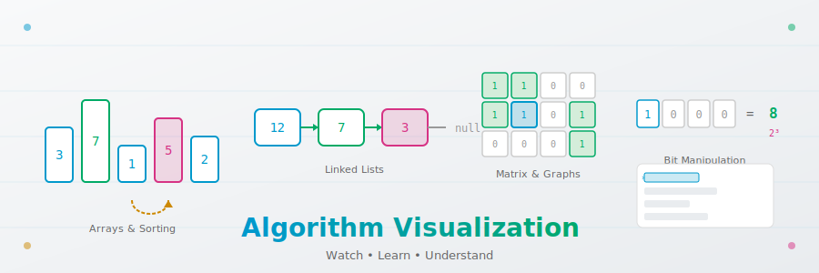

# Wizard

<div align="center">

### Interactive Algorithm Visualizations for Learning DSA

[](https://joshiayush.github.io/wizard/)
[](https://python.org)
[](LICENSE)

<br/>

<p align="center">
  
</p>

**[View Live Demo](https://joshiayush.github.io/wizard/)** | **[Report Bug](https://github.com/joshiayush/wizard/issues)** | **[Request Feature](https://github.com/joshiayush/wizard/issues)**

</div>

---

<div align="center">
  
</div>

---

## What is Wizard?

Wizard is an interactive algorithm visualization platform designed to help you understand data structures and algorithms through hands-on exploration. Watch algorithms execute step-by-step, see code highlight in sync, and build deep intuition for how they work.

---

## Features

<table>
<tr>
<td width="50%">

### Interactive Visualization
- **Play/Pause** - Auto-advance or step manually
- **Speed Control** - Adjust animation speed
- **Reset** - Start over with new inputs
- **Random** - Generate test cases automatically

</td>
<td width="50%">

### Code Synchronization
- **Line Highlighting** - See which line executes
- **Variable Tracking** - Watch values change
- **Syntax Highlighting** - Clean, readable code
- **Python Implementation** - Production-quality code

</td>
</tr>
<tr>
<td width="50%">

### Complexity Analysis
- **Time Complexity** - Big-O breakdown
- **Space Complexity** - Memory analysis
- **Mathematical Intuition** - Why it works
- **Key Insights** - Core algorithm ideas

</td>
<td width="50%">

### Modern Design
- **Dark Theme** - Easy on the eyes
- **Responsive** - Works on all devices
- **No Dependencies** - Pure HTML/CSS/JS
- **Fast Loading** - Instant visualization

</td>
</tr>
</table>

---

## Algorithm Catalog

### Arrays

| Algorithm | Technique | Time | Space | Description |
|:----------|:----------|:----:|:-----:|:------------|
| [Two Sum](https://joshiayush.github.io/wizard/arrays/two-sum/) | HashMap | O(n) | O(n) | Find two numbers that sum to target |
| [Sort Colors](https://joshiayush.github.io/wizard/arrays/sort-colors/) | Dutch National Flag | O(n) | O(1) | Sort array of 0s, 1s, and 2s in-place |
| [Maximum Subarray](https://joshiayush.github.io/wizard/arrays/maximum-subarray/) | Kadane's Algorithm | O(n) | O(1) | Find contiguous subarray with largest sum |
| [Best Time to Buy/Sell](https://joshiayush.github.io/wizard/arrays/best-time-to-buy-and-sell-stock/) | Single Pass | O(n) | O(1) | Maximize profit from stock transactions |
| [Hybrid Quick Sort](https://joshiayush.github.io/wizard/arrays/hybrid-quick-sort/) | 3-Way Partition | O(n log n) | O(log n) | QuickSort with duplicate handling |
| [Kth Largest Element](https://joshiayush.github.io/wizard/arrays/kth-largest-element/) | Max Heap | O(n + k log n) | O(n) | Find kth largest without full sort |

### Strings

| Algorithm | Technique | Time | Space | Description |
|:----------|:----------|:----:|:-----:|:------------|
| [KMP Pattern Matching](https://joshiayush.github.io/wizard/strings/kmp/) | Failure Function | O(n + m) | O(m) | Efficient substring search |
| [Longest Palindrome](https://joshiayush.github.io/wizard/strings/longest-palindromic-substring/) | Expand Around Center | O(n²) | O(1) | Find longest palindromic substring |

### Matrix

| Algorithm | Technique | Time | Space | Description |
|:----------|:----------|:----:|:-----:|:------------|
| [Number of Islands](https://joshiayush.github.io/wizard/matrix/number-of-islands/) | DFS/BFS | O(m×n) | O(m×n) | Count connected land components |
| [Flood Fill](https://joshiayush.github.io/wizard/matrix/flood-fill/) | BFS | O(m×n) | O(m×n) | Paint connected region with new color |
| [Shortest Path](https://joshiayush.github.io/wizard/matrix/binary-matrix-shortest-path/) | BFS 8-Direction | O(m×n) | O(m×n) | Find shortest path in binary matrix |

### Linked Lists

| Algorithm | Technique | Time | Space | Description |
|:----------|:----------|:----:|:-----:|:------------|
| [Sort Linked List](https://joshiayush.github.io/wizard/linked-list/sort-linked-list/) | Merge Sort | O(n log n) | O(log n) | Sort linked list using merge sort |
| [Merge K Lists](https://joshiayush.github.io/wizard/linked-list/merge-k-sorted-lists/) | Divide & Conquer | O(n log k) | O(log k) | Merge k sorted linked lists |

### Bit Manipulation

| Algorithm | Technique | Time | Space | Description |
|:----------|:----------|:----:|:-----:|:------------|
| [Power of Two](https://joshiayush.github.io/wizard/bit-manipulation/power-of-two/) | Bitwise AND | O(1) | O(1) | Check if number is power of 2 |

---

## Quick Start

### Prerequisites

- Python 3.13+ (for algorithm implementations)
- Any modern web browser (for visualizations)

### Installation

```bash
# Clone the repository
git clone https://github.com/joshiayush/wizard.git
cd wizard

# Install Python dependencies (optional, for running tests)
pip install poetry
poetry install
```

### Running Locally

```bash
# Using Python's built-in server
cd visualizations
python -m http.server 8000
# Visit http://localhost:8000
```

### Running Tests

```bash
poetry run pytest
```

---

## Tech Stack

<div align="center">

| Frontend | Backend | Tools |
|:--------:|:-------:|:-----:|
|  |  |  |
|  | |  |
|  | |  |

</div>

---

## Contributing

Contributions are welcome! Here's how to add a new algorithm:

1. **Add Python Implementation** in `algos/category/algorithm_name.py`
2. **Create Visualization** in `visualizations/category/algorithm-name/`
3. **Add to Index** - Update `visualizations/index.html`
4. **Add Tests** in `tests/category/test_algorithm_name.py`

---

## License

This project is licensed under the MIT License - see the [LICENSE](LICENSE) file for details.

---

<div align="center">

**Built with curiosity by [Ayush Joshi](https://github.com/joshiayush)**

<br/>

<a href="https://joshiayush.github.io/wizard/">
  
</a>

</div>
